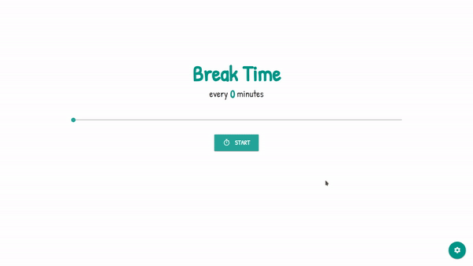

# Break Time

Created with only Vue.js!

A simple app to reminds you to take a break every now and then! Take a quick stretch and don't look at the screen. You just need to leave this app running, everytime the time passes it'll open your selection of youtube video in a new tab, so **please turn off/white-list pop-up blocker for this application in your browser.** You can try it live on https://dist-ktvfqxhfvo.now.sh/

## What You Can Do

* Set the time between every breaks.
* Set the youtube link to be opened once the break time reached.

## How to Run this App
```
npm install
npm run serve
```

### Compiles and Minifies for Production
```
npm run build
```

### Lints and Fixes Files
```
npm run lint
```

## GIF



## Built with

* [Vue.js](https://vuejs.org/) - JavaScript Framework
* [Materialize CSS](https://materializecss.com/) - CSS Framework

## Author

* **Muhammad Daivasmara Denaw** - [Daivasmara](https://github.com/Daivasmara)
